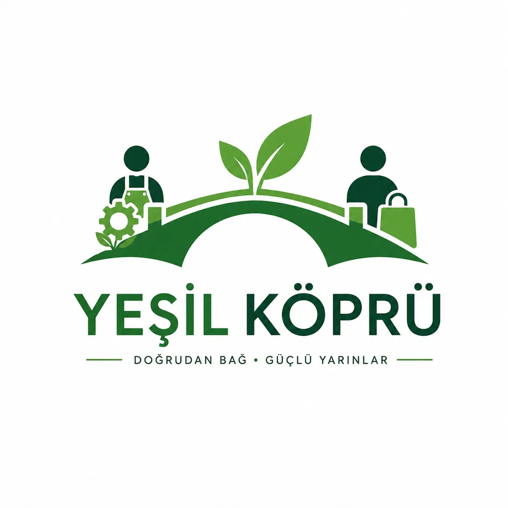

<p align="center">
  
</p>

# Yeşil Köprü — Aracısız Tarım Pazaryeri

**Yeşil Köprü**, çiftçiler (üreticiler) ile alıcıları aracısız buluşturan bir dijital tarım pazaryeri prototipidir. Üretici kıyısı ile alıcı kıyısı arasında bir köprü kurar: ürün tarladan doğrudan alıcıya geçer, aracı katkısı ve taşıma kayıpları ortadan kalkar.

> Tarım Teknolojileri Yarışması kapsamında hazırlanmış, tarayıcıda doğrudan çalışan bir demo/prototiptir.

---

## Problem

| İstatistik | Değer |
|---|---|
| Ürünlerin aracılar yüzünden fiyatlanma artışı | **%300 – %600** |
| Tüketiciye ulaşamadan israf olan meyve-sebze | **≈ %53** |
| Yeşil Köprü'deki aracı sayısı | **0** |

Geleneksel zincirde tarladan markete uzanan yolda ürün el değiştirdikçe katlanır; Yeşil Köprü bu zinciri tek bir doğrudan eşleştirmeye indirger.

## Bilimsel Doğrulama

- **Gerçek fiyat karşılaştırması:** Ana sayfada, Eylül 2026 toptancı hal bültenlerinden derlenen gerçek fiyatlar (Çanakkale, Çorum, Denizli, Eskişehir belediye bültenleri + Elmalı Toptancı Halı) ile platformdaki üretici arzları yan yana gösterilir. Örnek: domates hal fiyatı ₺30/kg iken platformda ürün + nakliye ₺19,17/kg — **%36 daha düşük**.
- **Şeffaf tasarruf matematiği:** "Tasarruf hesabı nasıl yapılır?" bölümü formülü adım adım açıklar: `Geleneksel fiyat = ürün bedeli × 4,5` (+%350 aracı katkısı, rapordaki %300–600 bandının orta değeri). +350'nin muhafazakâr bir varsayım olduğu ve gösterilen tasarrufun alt sınır niteliği taşıdığı açıkça belirtilir.
- **Kaynak gösterimi:** %300–600 ve %53 istatistikleri kaynak notuyla verilir.
- **Etki bandı:** Ana sayfada demo oturumunda doğrudan satışla kurtarılan ürün (kg), önlenen tasarruf kaybı (TL) ve tamamlanan eşleştirme sayısı canlı gösterilir.
- **İş modeli:** %2–3 işlem komisyonu + taşıyıcı hizmet payı; SMS/telefonla arz girişi ve kooperatif iş birliğiyle çiftçi benimseme planı; teslim onayına kadar escrow tipi ödeme koruması.
- **Kalıcılık:** Demo verileri `localStorage`'da tutulur — sayfa yenilense bile arzlar, siparişler ve oturum korunur; footer'daki "Demo verilerini sıfırla" bağlantısı her şeyi başa döndürür.

## Özellikler

- **Rol tabanlı kimlik doğrulama** — ayrı Giriş / Kayıt akışı; kayıt olurken ad-soyad, telefon, e-posta, il ve rol (Üretici/Alıcı) seçilir. Kullanıcı, rolüne uygun panele otomatik yönlendirilir.
- **Erişim kontrolü** — üretici paneli, alıcı paneli ve lojistik ağı giriş yapmadan kesinlikle görüntülenemez; her rol yalnızca kendi panelini açar.
- **Üretici Paneli** — ürün adı, miktar (kg), fiyat (TL/kg), konum (kayıt ilinden otomatik), hasat tarihi ve **ürün fotoğrafı** ile arz ekleme; aktif arzları listeleme ve silme. Fotoğraf yüklenirken en fazla 5 MB kontrolü uygulanır ve demo boyutunda kalmaları için 720 px genişlikte yeniden boyutlandırılır; fotoğrafsız arzlarda ürün adından üretilen monogram görseli gösterilir.
- **Alıcı Paneli** — ürün adı ve ile göre arama; sonuçların **haversine formülü** ile alıcının konumuna olan gerçek coğrafi mesafeye göre yakından uzağa sıralanması.
- **Eşleştirme akışı** — üretici + önerilen taşıyıcı + alıcı bilgisinin yan yana gösterildiği özet ekranı; ürün bedeli + nakliye = toplam şeklinde maliyet dökümü; aracılı zincire kıyasla tahmini tasarruf (+%350 aracı katkısı varsayımıyla). Onaylamayla arz satıldı olarak düşer, sipariş numarası üretilir ve "İşlem Başarılı!" onay ekranı gösterilir.
- **Sipariş Takibi** — eşleştirmeler, canlı bir durum akışına dönüşür: **Eşleştirildi → Yükleniyor → Yolda → Teslim Edildi** adımlarını gösteren ilerleme çubuğu, olay geçmişi (ne zaman, ne oldu), maliyet ve tasarruf özeti. Durumu üretici/alıcı birlikte ilerletir — üretici yüklemeyi başlatır ve sevkiyatı yola çıkarır, alıcı teslimi onaylar. "Aktif Siparişler / Tamamlananlar" sekmeleri ve panellerdeki tıklanabilir sipariş satırları takibi tek tıkla açar.
- **Lojistik Ağı** — taşıyıcı firmalar güzergâh (kalkış→varış ili), kapasite (ton) ve birim ücret (TL/ton) ile kaydolur. Tek araç kapasitesi **1–25 ton** (tır dorse seviyesi) ile sınırlıdır; daha büyük yükler birden fazla araçla karşılanır. Eşleşme sırasında sistem güzergâha ve kapasiteye en uygun taşıyıcıyı otomatik önerir (önce birebir güzergâh, yoksa en yakın hat).
- **Responsive tasarım** — masaüstünde ve mobilde düzgün görünüm; yeşil–bej paleti, tek toprak/bakır vurgu rengi ve rakamsal veriler için mono/teknik font.

## Demo Hesapları

Giriş ekranında "Doldur" düğmeleriyle tek tıkla denenebilir:

| Rol | E-posta | Şifre | Konum |
|---|---|---|---|
| Üretici | `ahmet@greenbridge.tr` | `123456` | Antalya |
| Alıcı | `zeynep@greenbridge.tr` | `123456` | İstanbul |

Kayıt ekranından yeni üretici/alıcı hesapları da oluşturulabilir; prototip 6 hazır kullanıcı, 9 örnek arz, 7 taşıyıcı firma ve 20 illik koordinat listesiyle gelir. Giriş yaptığınızda **Sipariş Takibi** sayfasında iki örnek sipariş (biri "Yolda", biri "Yükleniyor") hazır bulunur.

## Sipariş Durum Akışı

```
Eşleştirildi ──▶ Yükleniyor ──▶ Yolda ──▶ Teslim Edildi
  (onay)      üretici başlatır  üretici yola   alıcı onaylar
                                  çıkarır
```

Her adımda butonu gören taraf (üretici ya da alıcı) durumu ilerletir; karşı taraf "Bu adımı üretici/alıcı gerçekleştirir" notuyla bekler. Tamamlanan siparişler "Tamamlananlar" sekmesine düşer.

## Çalıştırma

Ek bir kurulum gerektirmez:

1. [`yesil-kopru.html`](./yesil-kopru.html) dosyasını indirin.
2. Herhangi bir modern tarayıcıda açın (çift tık yeterli).

Önerilen demo akışı: alıcı hesabıyla giriş yapın → arama sonuçlarının mesafeye göre sıralandığını görün → bir arzda **Eşleştir** deyin → maliyet dökümü ve tasarrufu inceleyin → **Alım-Satımı Onayla** → **Siparişi Takip Et** deyip durum akışını açın → üretici hesabıyla girip siparişi yola çıkarın → alıcı hesabında **Teslim Aldım** ile tamamlayın.

## Teknik Notlar

- **Tek dosya**: HTML + CSS + JS tek bir `yesil-kopru.html` içinde; harici framework/backend yoktur.
- **Bellek içi + localStorage veri**: kalıcı veritabanı yoktur; veriler tarayıcı `localStorage`'ında tutulur ve sayfa yenilense bile korunur (footer'daki "Demo verilerini sıfırla" bağlantısı temizler).
- **Haversine mesafesi**: il koordinatları üzerinden gerçek kuş uçuşu mesafesi hesaplanır; taşıyıcı önerisi de aynı koordinat tabanını kullanır.
- **Demo düzeyi giriş**: şifreler düz metin tutulur; gerçek ödeme, e-posta/SMS bildirimi ve production seviyesinde güvenlik bu aşamanın kapsamı dışındadır.
- **Görsel kimlik**: resmî logo (navbar, giriş ekranı ve favicon'a base64 gömülü — tek dosya yapısı korunur); köprü metaforu; Fraunces (başlık), Manrope (gövde), Space Mono (sayısal veri) fontları.

---

*Yeşil Köprü · Tarladan sofraya aracısız köprü*
